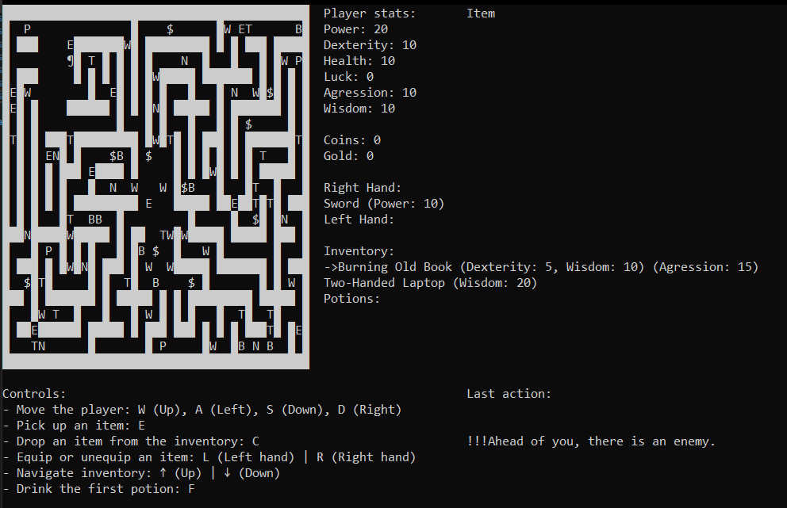

# RPG Game Documentation

## **Objective**

This project is a simple, console-based RPG game where the player navigates through a dungeon, interacts with items, and faces enemies. The game incorporates various design patterns to manage game objects, item effects, and the dungeon generation system. The project utilizes the **Decorator**, **Singleton**, and **Builder** design patterns to provide flexibility and modularity.

## Screenshot

  

## **Features**

* **Dungeon Generation:** Dynamically creates game worlds using a flexible Builder pattern for various dungeon layouts (empty, filled, paths, chambers, central room) and item/enemy placement.
* **Player & Character System:**
    * Players navigate a `20x40` grid-based room, respecting boundaries and walls.
    * Manages player attributes (Strength, Dexterity, Health, Luck, Aggression, Wisdom).
    * Two-handed inventory system with item equipping/unequipping.
* **Dynamic Item System:**
    * Various item types including weapons (single and two-handed), currencies (coins, gold), and unusable items.
    * **Decorator Pattern:** Items can be enhanced with multiple, stacking effects (e.g., "Unlucky," "Powerful") that modify item properties or player attributes.
* **Combat System:**
    * **Visitor Pattern:** Implements a flexible combat system allowing different weapon types (heavy, light, magic) and attack styles (normal, stealth, magic) to interact with enemies. Easily extensible for new weapons or attack methods.
    * Enemies with customizable health, attack, and armor.
* **Temporal Effects & Potions:**
    * **Observer Pattern:** Potions provide temporary or permanent attribute boosts (e.g., "power potion," "luck potion") with turn-based duration tracking.
    * Supports dynamic removal of effects (e.g., antidotes).
* **Modular Control System:**
    * **Chain of Responsibility Pattern:** Handles player input for movement, item interaction (pickup, drop, equip, use), and game exit.
    * Dynamically adjusts available actions and prompts based on game context.
* **Centralized Game State Presentation:**
    * **Singleton Pattern:** A dedicated display system for rendering the dungeon, player status (inventory, equipped items, attributes, currency), nearby enemy information, and action logs to the console. Designed for easy extensibility to new display types.
* **Multiplayer Capability:**
    * **Model-View-Controller (MVC) Pattern:** Refactored architecture to support networked gameplay.
    * **TCP/JSON Communication:** Enables client-server communication using `System.Text.Json` for game state synchronization.
    * Supports up to 9 networked players.
* **Dynamic Enemy AI:**
    * **Strategy Pattern:** Implements various enemy behaviors (calm, aggressive, timid) that dictate movement and attack patterns. Allows for easy addition or real-time modification of enemy AI.

---

## **Technical Showcase**

This project effectively demonstrates the application of key design patterns:

* **Decorator:** For item modification and effects.
* **Builder:** For dungeon generation and instruction display.
* **Singleton:** For centralized game state presentation.
* **Chain of Responsibility:** For robust keyboard input handling.
* **Observer:** For managing temporal effects and potion durations.
* **Visitor:** For flexible and extensible combat calculations.
* **Model-View-Controller (MVC):** For separating game logic, presentation, and input handling, especially for multiplayer.
* **Strategy:** For dynamic enemy AI behaviors.

---

## **How to Run**

1.  Clone the repository: `git clone [your-repo-link]`
2.  Navigate to the project directory.
3.  Build the project: `dotnet build`
4.  Run the game:
    * **Server Mode:** `dotnet run --server [port, default 5555]`
    * **Client Mode:** `dotnet run --client [ip:port, default 127.0.0.1:5555]`

---

## **Contributing**

Feel free to open issues or submit pull requests.

---